###    CHAT MESSENGER | Firebase | MVVM | FCM | Navigation | Retrofit | Kotlin Coroutines | 

#### Features 
1. Firebase Cloud Messaging (FCM) & Retrofit for Push notification
2. Firestore 
3. Navigation component 
4. Two way databinding
5. MVVM architecture 
6. Kotlin coroutines 
7. Firebase storage


#### Firebase Structure

Messages:
```
Collection: Messages 
   Document: chatroomid 
       Collection: chats
         Document: Timestamp
         
 For Chatroomid: generated a unique id by using the sort function to join sender's & receiver's id. The order of the unique id will remain
 same regardless of the sender or receiver while adding the document to collection
       
         
```


#### Images 

#### Login Screen 

<div style="display: flex; flex-direction: row;">
  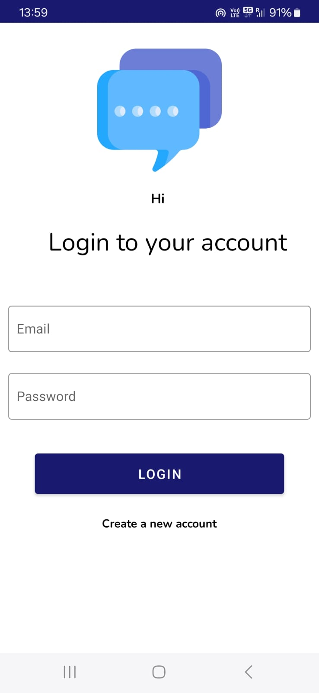
</div>


#### Home Screen 

<div style="display: flex; flex-direction: row;">
  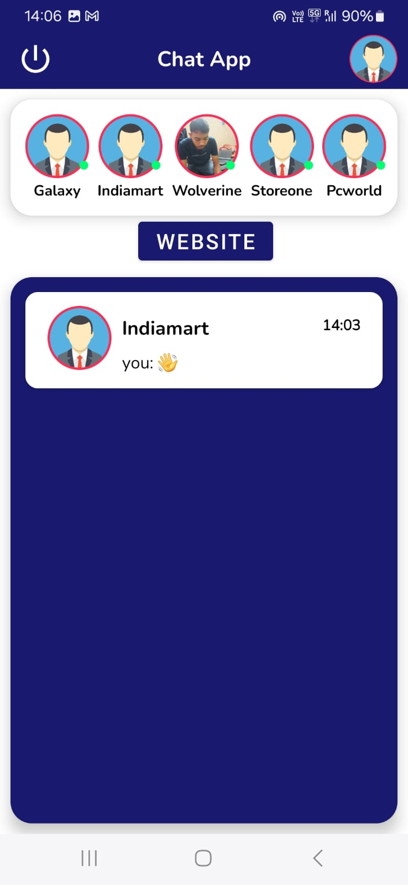
</div>


#### One on One Chat Screen 

<div style="display: flex; flex-direction: row;">
  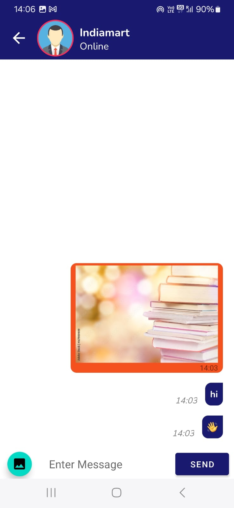
</div>


#### Setting Screen

<div style="display: flex; flex-direction: row;">
  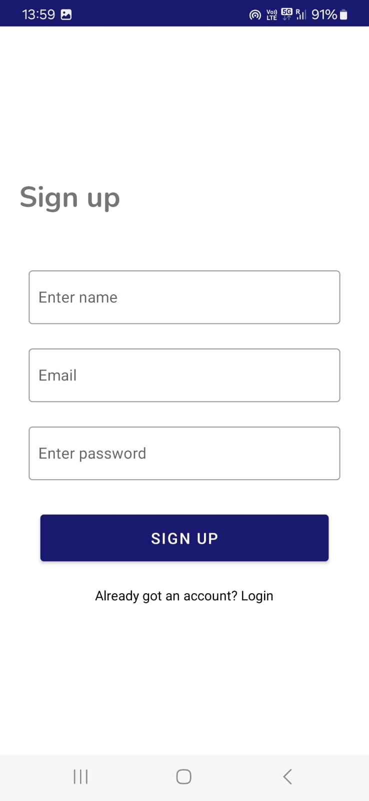
  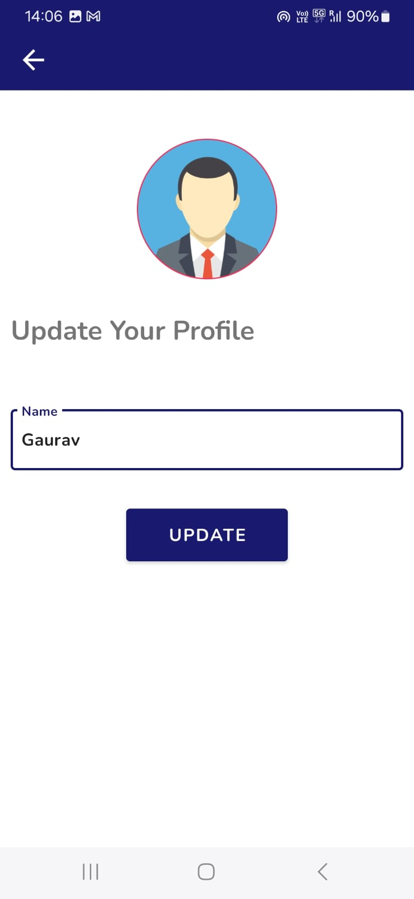

</div>


#### website 

<div style="display: flex; flex-direction: row;">
  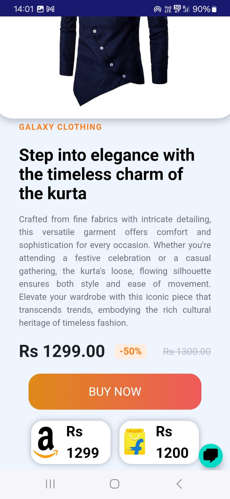
  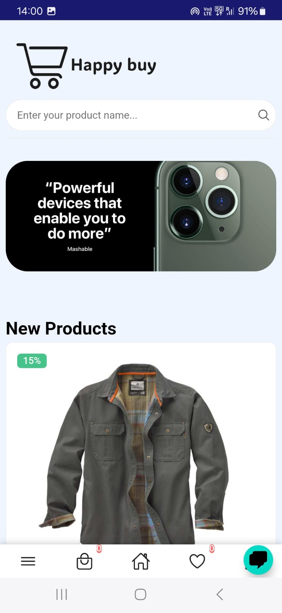
</div>


<div style="display: flex; flex-direction: row;">
  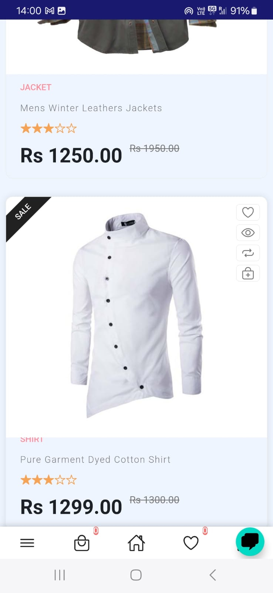
  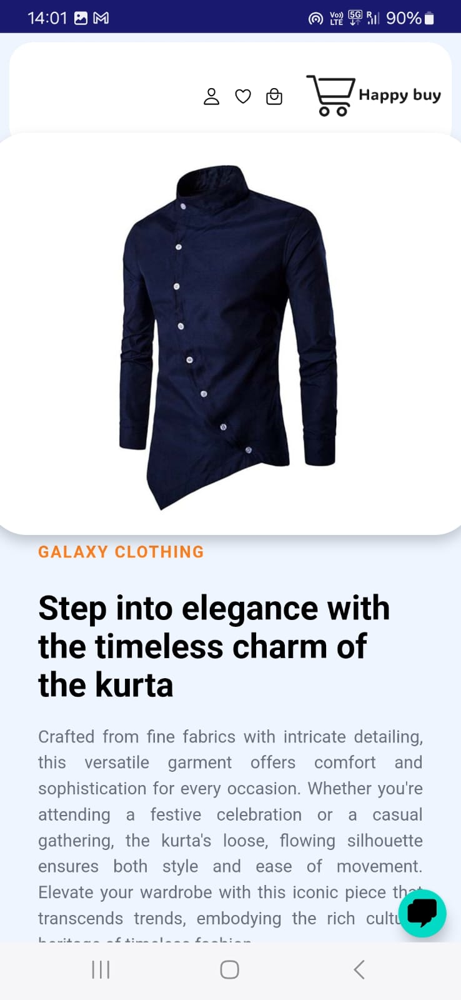
</div>

<div style="display: flex; flex-direction: row;">
  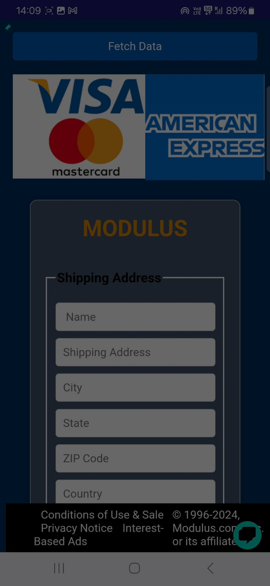
  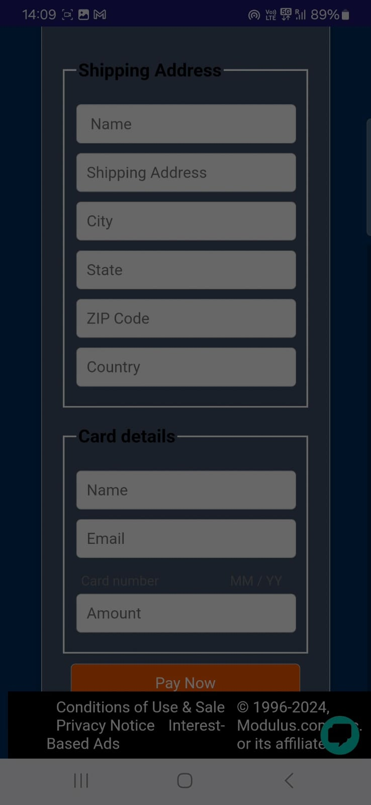
</div>


##### Thank you
